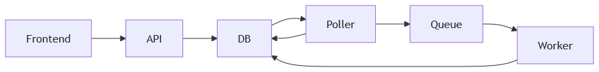
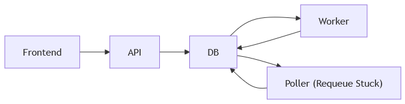

##### 1  [Project Overview](#1-project-overview)
##### 2  [Quick Start](#2-quick-start)
##### 3  [Key Features](#3-key-features)
##### 4  [Architecture Overview](#4-architecture-overview)
##### 5  [Job Lifecycle](#5-job-lifecycle)
##### 6  [Observability](#6-observability)
##### 7  [Horizontal Scaling](#7-horizontal-scaling)
##### 8  [Repository Structure](#8-repository-structure)
##### 9  [Configuration](#9-configuration)
##### 10  [Local Development](#10-local-development)
##### 11  [Kubernetes Deployment](#11-kubernetes-deployment)
##### 12  [Testing and CI](#12-testing-and-ci)

## 1 Project Overview

**job-processor** is a distributed job processing framework designed to demonstrate the architecture and operational considerations behind reliable background task systems.

The project implements an end-to-end job processing pipeline including job creation, queueing, worker execution, retry logic, monitoring, and horizontal scaling. While the current job workload is simulated, the system is designed to be workload-agnostic and can serve as a foundation for a variety of asynchronous processing tasks.

The system is composed of several services working together:
- **Node.js API** for job creation and status monitoring
- **Go workers and pollers** responsible for executing queued jobs, and enqueueing work to be done respectively
- **PostgreSQL** for durable job state and persistence
- **React frontend** providing a minimal interface for submitting and observing jobs
- **Prometheus and Grafana** for monitoring and observability

The repository contains two alternative queue implementations:

- A **Redis-backed** queue using Redis lists
- A **PostgreSQL-based** queue using `LISTEN/NOTIFY` with polling fallback

These implementations exist as separate branches and allow tradeoffs between infrastructure complexity, operational simplicity, and performance priority.

The goal of the project is to provide a clean and extensible reference implementation of a modern job processing system built with strong development and infrastructure practices to be used in future projects.

## 2 Quick Start

Run the full stack locally using Docker Compose.

`git clone https://github.com/sgawalsh/job-processor` 
`cd job-processor` 
`cd api && npm install` 
`cd ../frontend && npm install` 
`docker compose -f docker-compose.yaml -f docker-compose.dev.yaml up --build`

Then open:
- **Frontend**: http://localhost:8080
- **Grafana**: http://localhost:3000

## 3 Key Features
- **Distributed Job Processing Pipeline**: End-to-end job lifecycle including submission, queueing, execution, retries, and completion tracking.
- **Multiple Queue Implementations**: Two alternative queue backends implemented as separate branches:
    - Redis queue using Redis lists
    - PostgreSQL queue using `LISTEN/NOTIFY` with polling fallback
- **Configurable Worker Scaling**: Worker replicas can be adjusted via docker-compose.yml for local environments, and scale automatically in Kubernetes deployments using KEDA ScaledObjects.
- **Worker / Poller Architecture**: A single Go binary implements both the poller (responsible for enqueueing future jobs) and the worker (responsible for executing jobs).
Runtime behaviour is controlled via a role environment variable.
- **Retry and Recovery Logic**: Failed jobs are retried using configurable retry attempts with fixed backoff. The system includes logic for detecting and re-queuing stalled or abandoned jobs.
- **Durable Job State Tracking**: Job status is stored in PostgreSQL and modeled using a strict job_status ENUM to enforce valid state transitions.
- **Built-In Observability**: Metrics are exposed via `/metrics` endpoints for both the API and worker services.
Additional exporters provide metrics for PostgreSQL and Redis.
- **Grafana Monitoring Dashboards**: Includes preconfigured dashboards for:
    - PostgreSQL
    - Redis
    - Custom job processing metrics from the API and worker services
- **Flexible Development and Deployment**: The system can be run locally using Docker Compose or deployed to Kubernetes, with infrastructure and monitoring configurations included in the repository.
- **Minimal Demo Frontend**: A lightweight React UI demonstrates job submission and status tracking through the API.

## 4 Architecture Overview

#### Redis Queue

#### Postgres Notifications

#### Components
- **Frontend**
Minimal React application that allows users to submit jobs and view status updates via the API.
- **API (Node.js/Express)**
Handles job creation and progress monitoring. Stores job metadata in PostgreSQL and interacts with the queue backend (Redis or PostgreSQL notifications).
- **Database (PostgreSQL)**
Stores job records with status managed via a job_status ENUM. Supports durable state and enables retries and re-queueing. Functions as the source of truth throughout the job lifecycle.
- **Worker / Poller (Go)**
A single binary implements both:
    - **Poller**
        - **Redis Branch** - Detects and enqueues PENDING jobs to redis queue and updates postgres status. Also recovers stuck jobs in QUEUED and RUNNING status.
        - **Postgres Notifications Branch** - Recovers jobs stuck in RUNNING status. Queueing is handled by postgres notifications.
    - **Worker** – claims and executes jobs, updates status in the database
- **Queue Backend**
Determines how jobs are distributed to workers:
    - **Redis Version**: Jobs are pushed into a Redis list which acts as the queue. Workers pop job IDs from the queue and then atomically claim the job in PostgreSQL using a conditional UPDATE to ensure that only one worker processes it.
    - **PostgreSQL Notification Version**: Jobs are detected via `LISTEN/NOTIFY` with a polling fallback. Workers claim jobs using `SELECT ... FOR UPDATE SKIP LOCKED`, ensuring safe concurrent access and avoiding double-processing.
- **Metrics & Observability**
Both API and worker expose `/metrics` endpoints for Prometheus. Postgres and Redis metrics are also collected via exporters, with preconfigured Grafana dashboards to visualize system state and job processing performance.

## 5 Job Lifecycle

### Job Flow

1. **Job Submission**: The API receives a job request and inserts a new record in PostgreSQL with status PENDING.
    - In the Redis branch, a poller detects new PENDING jobs and pushes their IDs into the Redis queue, updating the job status to QUEUED.
    - In the Postgres notifications branch, the poller detects new PENDING jobs via `LISTEN/NOTIFY`, or via polling fallback
2. **Worker Claiming**: Workers claim jobs using branch-specific locking logic
    - Redis: conditional UPDATE ensures only one worker can claim a job (QUEUED → RUNNING).
    - Postgres: SELECT ... FOR UPDATE SKIP LOCKED guarantees safe concurrent claims without race conditions.
3. **Job Execution**: The worker performs the task (currently a simulated workload via sleep). During this phase, the job status is RUNNING.
    - On success, the job status updates to SUCCEEDED.
    - On failure, the job status is set to FAILED and the system may retry depending on configuration.
4. **Retry Logic**: Jobs can be retried a configurable number of times (MAX_ATTEMPTS) with fixed backoff. Retry parameters are set via environment variables, allowing testing of different failure recovery scenarios.
5. **Stuck Job Recovery**: If a job remains in RUNNING or QUEUED longer than expected (e.g., due to a worker crash), the poller can requeue or reset the job, ensuring it is retried instead of being lost.
6. **Cron Cleanup**: Successfully completed jobs are periodically deleted by a postgres cron job to prevent unbounded growth in the database. This ensures the system remains performant over time.

### Reliability Highlights
- **Atomic Job Claiming** – prevents multiple workers from processing the same job concurrently.
- **Retry and Backoff** – simple but effective fixed backoff ensures failed jobs are re-attempted reliably.
- **Branch-Specific Behavior**
    - Redis branch includes an explicit QUEUED state for the queue.
    - Postgres branch eliminates QUEUED, relying on PENDING detection and polling.
- **Crash Recovery** – stuck jobs are detected and requeued automatically.
- **Idempotency Considerations** – though the current job workload is simulated, the design supports safe re-execution without duplicate side effects.

## 6 Observability

The system includes built-in observability using Prometheus and Grafana, enabling monitoring of job processing performance, queue health, and service behaviour.

Metrics are exposed from multiple components and collected automatically in both Docker Compose and Kubernetes deployments.

### Metrics Collection

Prometheus scrapes metrics from the following sources:

- **API**: /metrics endpoint exposed by the Node.js service
- **Worker**: /metrics endpoint exposed by the Go worker
- **PostgreSQL**: postgres-exporter
- **Redis (Redis branch)**: redis-exporter

These metrics provide visibility into:
- job throughput
- worker activity
- queue depth
- database performance
- Redis queue behavior

### Grafana Dashboards

Grafana is preconfigured to load dashboards automatically at startup.

Dashboards are stored in the repository under a dedicated grafana-dashboards directory and are provisioned via configuration files in both deployment environments.

The project includes:
- **Prebuilt Dashboards**
    - PostgreSQL monitoring dashboard
    - Redis monitoring dashboard (Redis branch)
- **Custom Dashboards**
    - API metrics dashboard
    - Worker metrics dashboard

These dashboards provide insight into job execution rates, service health, and system performance during operation.

### Deployment Integration

Observability tooling is included in both supported deployment modes:
- **Docker Compose** – Prometheus and Grafana run as part of the local stack
- **Kubernetes** – monitoring components are deployed alongside the application services

Dashboards are automatically provisioned via configuration files (.json or .yaml) stored in the repository, ensuring consistent monitoring across environments without manual setup.

## 7 Horizontal Scaling
The system supports horizontal scaling of worker processes to handle varying job workloads. Scaling behaviour differs slightly between the Redis and PostgreSQL queue implementations.

### Local Development

In **Docker Compose**, worker concurrency can be increased by adjusting the number of worker service replicas defined in docker-compose.yml.

This allows local testing of concurrent job processing and failure scenarios without requiring a full Kubernetes environment.

### Kubernetes Autoscaling with KEDA

In Kubernetes deployments, worker scaling is managed using **KEDA (Kubernetes Event-Driven Autoscaling)**. KEDA allows the worker deployment to scale automatically based on queue depth.

Separate scaling triggers are used depending on the queue backend.

- **Redis Queue Branch**: Workers scale based on the length of the Redis job queue. KEDA monitors the Redis list: `jobs:queue` using the listLength trigger.
- **PostgreSQL Notifications Branch**: Workers scale based on the number of pending jobs in the database. KEDA executes the following query: `SELECT COUNT(*) FROM jobs WHERE status = 'PENDING';` An index on status = 'PENDING' ensures this query remains efficient even as the job table grows.

In each case, as the number of pending jobs increases, KEDA scales the worker deployment to increase processing throughput.

## 8 Repository Structure

**job-processor** 
├── **api/** - Node.js Express API responsible for job creation, status tracking 
├── **frontend/** - Minimal React + Vite application used to submit jobs and monitor their progress 
├── **infra/** - Infrastructure configuration including Kubernetes manifests, ingress configuration, monitoring configuration, and Grafana dashboards 
├── **postgres/** - Dockerfile specifying database image and dependency installation 
├── **worker/** - Go-based worker and poller implementation responsible for job execution, retries, and status updates 
├── **docker-compose.yaml** - Primary development stack including API, workers, database, monitoring, and optional Redis queue 
├── **docker-compose.dev.yaml** - Environment-specific variables for development configuration 
├── **docker-compose.prod.yaml** - Environment-specific variables for production configuration 
└── **.env** - Centralized configuration for application behaviour, including retry parameters, worker roles, and service connection settings 

## 9 Configuration

Application behaviour is configured using environment variables.
For Docker Compose deployments, these values are defined in the repository’s .env file.

In Kubernetes deployments, equivalent values are provided via ConfigMaps and Secrets defined in the infra/ directory.

By setting these variables, a user can set key ports and user credentials for the api, grafana, postgres, and redis. Additionally, the user can adjust application performance and behaviour, enabling the clean-up cron job and setting it's scheduling parameters. The user can also adjust the worker and poller behaviour, setting timeouts, job retries, and the container-level worker concurrency.

### Environment Parity

Both Docker Compose and Kubernetes deployments share the same configuration model:
- **Docker Compose** → .env file
- **Kubernetes** → ConfigMap + Secret

This ensures behaviour remains consistent across development and cluster environments.

## 10 Local Development

The project can be run locally using Docker Compose, which launches the full stack including the API, worker services, database, monitoring stack, and optional Redis queue.

### Prerequisites

Ensure the following tools are installed:
- Docker
- Docker Compose
- Node.js (for installing frontend and API dependencies)

### Install Dependencies

Before building the containers, install the Node.js dependencies for the API and frontend.

`cd api`
`npm install`

`cd ../frontend`
`npm install`
### Build and Start the Stack

From the repository root directory, build and start all services:

`docker compose -f docker-compose.yaml -f docker-compose.dev.yaml build` 
`docker compose -f docker-compose.yaml -f docker-compose.dev.yaml up`

This will start the full development environment including:
- API service
- worker / poller services
- PostgreSQL database
- Redis (Redis branch only)
- Prometheus monitoring
- Grafana dashboards
- frontend UI

## Accessing the Services

Once the stack is running, the following services will be available:

Service	Address
- **Frontend UI**	http://localhost:8080
- **API**	http://localhost:8080/api
- **Grafana**	http://localhost:3000

Grafana login credentials are defined in the .env file.

### Stopping the Environment

To stop all services run: `docker compose down`

## 11 Kubernetes Deployment

The repository includes Kubernetes manifests and a bootstrap script that provisions the entire application stack, including monitoring and autoscaling.

The Kubernetes configuration is located in the infra/k8s/ directory and is designed to deploy a complete environment with minimal manual setup.

### Bootstrap Process

A bootstrap script is provided to install and configure the cluster components in the correct order. The script performs the following steps:

- **Create Namespaces** - Namespaces are created for application services and infrastructure components.
- **Install Monitoring Stack** - The monitoring stack is deployed using the kube-prometheus-stack Helm chart, which includes:
    - Prometheus
    - Grafana
    - Alertmanager
    - Node exporters
    - Kubernetes metrics
- **Deploy Application Services**: Application manifests are applied, including:
    - API deployment
    - worker deployment
    - PostgreSQL
    - Redis (Redis branch only)

- **Install KEDA** - KEDA is installed via Helm and used to enable event-driven autoscaling of worker pods based on queue depth.
- **Apply Monitoring Resources** - Custom monitoring resources are applied, including:
    - Prometheus ServiceMonitor objects
    - Grafana dashboards for application metrics

- **Install Ingress Controller** - An NGINX Ingress Controller is deployed to expose the API and frontend services.
- **Apply Application Ingress Resources** - Ingress routes are configured for:
    - API service
    - Frontend service

The script includes readiness checks to ensure each component is available before proceeding to the next step.

### Running the Bootstrap Script
From the infra/k8s/ directory:

`.\bootstrap.ps1`

The script will:
- deploy the monitoring stack
- install KEDA
- deploy the application services
- configure ingress routing
- provision Grafana dashboards

Once complete, the cluster will be fully operational.

### Cluster Components

The Kubernetes deployment includes the following infrastructure:

- **PostgreSQL** - Persistent job storage
- **Redis** - Queue backend (Redis branch)
- **API service** - Job submission and status tracking
- **Worker service** - Job execution and retry handling
- **Prometheus** - Metrics collection
- **Grafana** - Monitoring dashboards
- **KEDA** - Event-driven autoscaling
- **NGINX Ingress** - External service routing
### Autoscaling Behavior
Worker pods scale automatically based on queue workload:
- **Redis branch**: scales using Redis list length
- **PostgreSQL branch**: scales using the number of PENDING jobs

This allows the system to dynamically adapt to changes in workload.

### Monitoring

Prometheus automatically scrapes metrics from:
- **API** /metrics
- **worker** /metrics
- **PostgreSQL exporter**
- **Redis exporter**

Grafana dashboards are automatically provisioned during deployment.

## 12 Testing and CI

The project includes automated testing and security checks using GitHub Actions.

Continuous integration workflows ensure that code changes are validated and container images are scanned for vulnerabilities before being merged.

### Automated Tests

The CI pipeline runs tests for all major application components.

| **Component** | **Test Framework** |
|---|---|
| API | `npm test` |
| Frontend | `npm test` |
| Worker/Poller | Go test suite against migrated PostgreSQL database |

### Container Security Scanning

Container images for the main services are automatically scanned for vulnerabilities:
- API image
- frontend image
- worker image

These scans help identify vulnerable system packages or dependencies introduced during container builds.

### Dependency Management

The repository uses Dependabot to keep dependencies up to date. Automated update checks are configured for:
- Dockerfiles
- docker-compose configuration
- Node.js dependencies (npm)
- Go modules (go.mod)

Dependabot creates pull requests when updates are available, helping ensure the project remains secure and current.

### CI Goals

The CI pipeline is designed to ensure:
- application components compile and run correctly
- unit tests pass across all services
- container images are scanned for security issues
- dependencies remain up to date